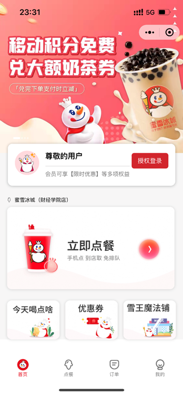
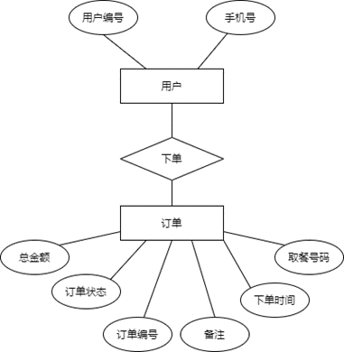
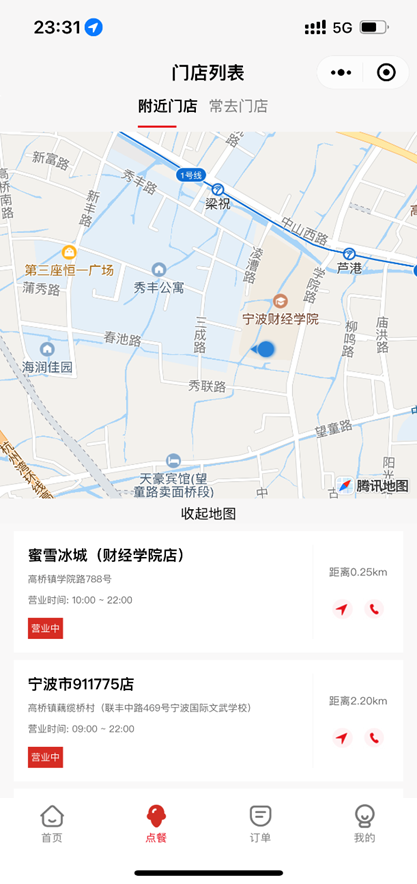
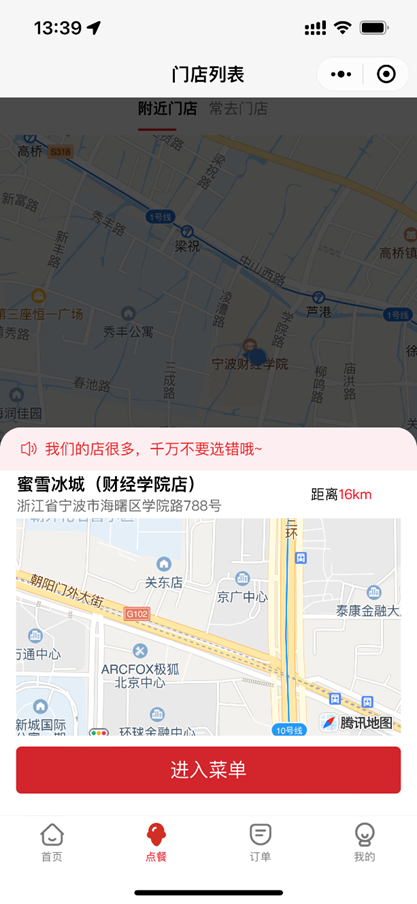
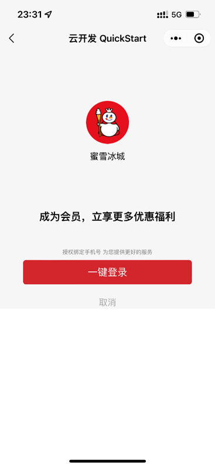
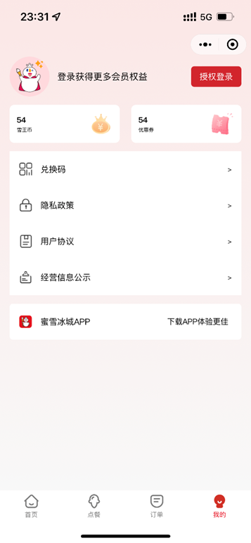

# 1. 引言

本小程序是原生开发，后端采用的低代码化的腾讯云开发，下载后配置云环境添加云数据即可使用。

## 1.1 课题背景

随着科技的高速发展，互联网时代的来临，正在逐渐地改变着人们传统的生活方式，影响着人们的衣食住行。目前，国内餐饮行业发展迅速，同时，竞争也日益激烈，通过网络技术提高服务水平和服务效率，满足服务人性化需求，进一步提高竞争力是餐饮行业发展的必然趋势。

得益于人们消费习惯的改变，餐饮行业数字化是餐饮行业壮大不可或缺的一项条件，而在数字化领域，腾讯又掌握中国社交领域半壁江山。腾讯的护城河毫无疑问是流量，手握微信加 QQ 的王炸组合，基本上涵盖了中文互联网上的所有网民，腾讯投资的逻辑就是传统互联网的打法，用流量灌溉餐饮商家。线上的竞争说到底就是流量之争。谁掌握了流量，就意味着谁在竞争中走得更远。腾讯微信注册人数达十几亿，小程序活跃用户丰富，市场广阔。因此开发一款具有线上点餐功能的小程序正好满足了传统餐饮商家转型升级的需要。点餐系统的开发和应用在国内越来越广，其中以微信小程序平台的点餐系统最为广泛，且点餐效率得到有效提高。

本文在此背景下，通过系统需求分析，系统设计，并使用微信小程序原生开发和腾讯云开发，设计并实现出基于微信小程序的点餐系统。

## 1.2  研究的主要内容

微信小程序是一种无需安装即可使用的应用，用户只要“扫一扫”或“搜一搜”就能打开应用，省去了安装或卸载的步骤。微信小程序运行在微信基础上，它的交互类似于手机原生应用，但是每个应用的体积非常小（目前上限是 2048kb），具有无需安装、触手可及、用完即走、无需卸载的特点。微信小程序借鉴了现有的 Web 微信点餐系统小程序的设计与实现技术，通过独立的运行环境实现了跨平台，并提供了接近原生 APP的使用体验，具有明显的优势。为了降低微信小程序的开发成本，提高开发效率，微信小程序的开发方式与 Web APP 相似，即通过WXML （类似 HTML ）、WXSS （类似 CSS ）和 JavaScript 进行开发，小程序也有一套脚本语言，为 WXS (WeiXin Script)，语法与JavaScript 类似又存在少量差异，并且提供了丰富的组件、API APP 内打开和接口，从而具有更接近原生 APP 的使用体验。并且相比于原生 APP，微信小程序具有上亿用户量的天然优势，能够有更多资源和机会获得新用户，为餐饮平台创造更多的市场。

 

# 2. 系统设计

## 2.1                     

次小程序包括四个菜单栏，分别是首页、点餐、订单和我的。首页设计为轮播图、授权登录和进入点餐。点餐设计为地图、门店搜索和门店列表，点击某一门店可以查看当前店铺菜单详情。订单设计为进行中订单、历史订单和退单。

## 2.2      数据库设计

### 2.2.1 概念模型设计
 

### 2.2.2 物理模型设计

1门店表

| 字段         | 类型        | 注释     |
| ------------ | ----------- | -------- |
| name         | Varchar(10) | 门店名称 |
| status       | Boolean     | 开店状态 |
| Opening_time | Varchar(20) | 营业时间 |
| Phone        | Varchar(20) | 联系电话 |
| address      | Varchar(20) | 门店地址 |

2.规格表

| 字段  | 类型        | 注释 |
| ----- | ----------- | ---- |
| Label | Varchar(10) | 标识 |
| price | int         | 规格 |

3.规格分类表

| 字段    | 类型        | 注释           |
| ------- | ----------- | -------------- |
| Label   | Varchar(10) | 标识           |
| price   | int         | 规格           |
| maxUnit | Int         | 最大可选规格数 |

4.商品分类表

| 字段  | 类型        | 注释 |
| ----- | ----------- | ---- |
| Label | Varchar(10) | 标识 |
| Icon  | Varchar(20) | 图标 |

# 3. 系统实现

## 3.1      主页功能实现

 主页主要包括轮播图、会员权益和立即点餐三大模块组成。点击轮播图可以跳转到相应的微信推文，授权登录后可以转成登录状态，显示会员等级和权益升级。立即点餐可以跳转到点餐tabbar进行点餐。

## 3.2          点餐功能实现

进入点餐页面，出现地图组件查看门店地址，切换可查看常用门店，点击专属门店可以弹出提示框进入门店，进入门店后可以进行商品的筛选和点餐 

## 3.3      订单界面

订单界面可以显示进行中、历史和退单的三种订单状态。

## 3.4      我的界面

我的界面包含个人基本信息，优惠券，兑换码，亦可进行授权登录。

 

# 4. 项目总结体会（1页）

微信小程序这门课让我们对小程序的认识有了大大的提升，从一开始只是使用他人成形的小程序，到现在一学期下来的学习，可以独立开发一款小程序，我们学会了了许多的知识。本次团队项目让我对项目有了更深层次的认识，懂得了光有理论知识，没有动手实践的话，也是纸上谈兵。与此同时，一个项目是由一个好的团队组成，所有我们更加意识到了团队合作的重要性，在项目的开发过程中，一些争议固然不可避免，但我们学会了通过讨论、协商，群策群力，在不断地磨合中达成一致与默契。软件工程知识的学习我只是进行了一个开始，今后还有更多知识等着我去学习。下面是对于小程序学习过程中的一些总结。

1.小程序中没有div这个标签，使用view代替，其他的大致相同。

2.页面布局去看 Flex布局。

3.JS代码编写跟H5差不多，小程序拥有一些自己的API。

做时需要注意的点：

1.保证间距（不同板块之间的间距，字体间距，要知道padding 和 margin）

2.对齐（图片和图片，字体和图片等等 要知道 左对齐，右对齐，居中对齐）

页面和后台的交互：

1.不同于H5，小程序中的事件bindtap="事件名"，这里事件名后面不带括号。传参使用data-自定义名称="要传递的值"。

2.嵌套循环的时候要自定义下表，不然数据会乱掉

3.一些组件会有一些独有的方法，这些方法就需要我们去API中进行了解，比如switch开关事件，按钮绑定form表单提交事件,picker日期或者省市区联动的事件

